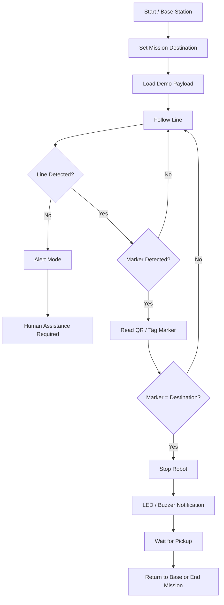

# 🏥 hospitalrobot

**Open-source εκπαιδευτικό ρομπότ διανομής εντός προσομοιωμένου νοσοκομειακού περιβάλλοντος με line-following, QR/tag recognition και μηχανισμό μεταφοράς μικρού φορτίου**

---

## 1. Σύντομη περιγραφή

Το **hospitalrobot** είναι ένα εκπαιδευτικό, open-source ρομποτικό έργο που αναπτύχθηκε από μαθητές Γυμνασίου στο πλαίσιο της θεματικής **«Ανοιχτές Τεχνολογίες για το Κοινό Καλό»**.

Το έργο προσομοιώνει ένα απλό ρομποτικό σύστημα διανομής υλικών σε νοσοκομειακό περιβάλλον. Το ρομπότ σχεδιάστηκε ώστε να:

* κινείται αυτόνομα ακολουθώντας γραμμή στο πάτωμα,
* αναγνωρίζει σταθμούς / δωμάτια μέσω QR ή tag markers,
* μεταφέρει μικρό demo φορτίο,
* ειδοποιεί με buzzer και LEDs σε περίπτωση παράδοσης ή αποτυχίας,
* λειτουργεί ως εκπαιδευτική μακέτα και όχι ως πραγματικό ιατρικό σύστημα.

Το project δεν λαμβάνει ιατρικές αποφάσεις, δεν επεξεργάζεται προσωπικά δεδομένα ασθενών και δεν διαχειρίζεται πραγματικά φάρμακα.

---

## 2. Κατάσταση έργου

**Κατάσταση:** Μερικώς υλοποιημένο πρωτότυπο / work in progress

Το έργο δεν ολοκληρώθηκε πλήρως μέσα στον διαθέσιμο σχολικό χρόνο. Η ομάδα έφτασε σε στάδιο μερικού λειτουργικού πρωτοτύπου και τεκμηρίωσε τη βασική αρχιτεκτονική, τη ροή λειτουργίας, τη λίστα υλικών, το κόστος, τον βασικό αλγόριθμο και μέρος της κατασκευής.

Κατά τη διάρκεια των δοκιμών σημειώθηκαν δύο κατασκευαστικά ατυχήματα που προκάλεσαν ζημιές στο ρομποτικό πρωτότυπο και καθυστέρησαν την πλήρη ενοποίηση όλων των υποσυστημάτων.

Επιπλέον, μέρος του αρχικού κώδικα αναπτύχθηκε κατά τη διάρκεια των εργαστηριακών συναντήσεων, αλλά δεν παραδόθηκε ως πλήρης και τεκμηριωμένη τελική έκδοση στο αποθετήριο. Για τον λόγο αυτό, στο repository κατατίθεται βασικός σκελετός κώδικα και ψευδοκώδικας που αποτυπώνουν τη σχεδιασμένη αλγοριθμική λειτουργία του συστήματος.

Το έργο υποβάλλεται ως τεκμηριωμένο εκπαιδευτικό πρωτότυπο και όχι ως πλήρως ολοκληρωμένο προϊόν.

---

## 3. Εκπαιδευτικός σκοπός

Ο βασικός σκοπός του έργου είναι οι μαθητές να κατανοήσουν πώς οι ανοιχτές τεχνολογίες, η ρομποτική και ο αυτοματισμός μπορούν να αξιοποιηθούν για κοινωνικά χρήσιμες εφαρμογές.

Μέσα από το hospitalrobot, οι μαθητές εργάστηκαν πάνω σε:

* αναγνώριση πραγματικών κοινωνικών αναγκών,
* σχεδιασμό τεχνολογικής λύσης για το κοινό καλό,
* χρήση αισθητήρων και ενεργοποιητών,
* βασικές αρχές αυτόνομης πλοήγησης,
* QR/tag recognition,
* μηχανικό σχεδιασμό και κατασκευή,
* προγραμματισμό με λογική καταστάσεων,
* δοκιμές, αστοχίες και επανασχεδιασμό,
* τεκμηρίωση έργου με ανοιχτές άδειες.

Η εκπαιδευτική αξία του έργου δεν περιορίζεται στην τελική λειτουργία του ρομπότ. Ιδιαίτερη σημασία δόθηκε στη διαδικασία σχεδιασμού, στη συνεργασία, στην επίλυση προβλημάτων και στην κατανόηση ότι η τεχνολογία πρέπει να υπηρετεί ανθρώπινες και κοινωνικές ανάγκες.

---

## 4. Πρόβλημα που επιχειρεί να προσομοιώσει

Σε μεγάλες δημόσιες ή ιδιωτικές δομές υγείας υπάρχουν συχνά επαναλαμβανόμενες ανάγκες εσωτερικής μεταφοράς υλικών, όπως:

* έγγραφα,
* αναλώσιμα,
* μικρά πακέτα,
* μη ευαίσθητα υλικά,
* εκπαιδευτικά demo φορτία.

Η ιδέα του hospitalrobot είναι να προσομοιώσει, σε μικρή κλίμακα, ένα τέτοιο σύστημα εσωτερικής διανομής.

Το σχολικό πρωτότυπο δεν έχει στόχο να αντικαταστήσει προσωπικό υγείας ή να χρησιμοποιηθεί σε πραγματικό νοσοκομείο. Στόχος είναι να λειτουργήσει ως εκπαιδευτικό μοντέλο για τη συζήτηση γύρω από:

* την αυτοματοποίηση,
* την ασφάλεια,
* την αξιοπιστία,
* το κόστος,
* την κοινωνική ωφέλεια,
* τα όρια της τεχνολογίας.

---

## 5. Προτεινόμενη λύση

Η προτεινόμενη λύση είναι ένα μικρό ρομποτικό όχημα βασισμένο σε ανοιχτές εκπαιδευτικές τεχνολογίες.

Το ρομπότ σχεδιάστηκε ώστε να κινείται σε προκαθορισμένη διαδρομή πάνω σε γραμμή, να αναγνωρίζει σταθμούς μέσω QR/tag markers και να παραδίδει ένα μικρό demo φορτίο σε προκαθορισμένο σημείο.

Η λειτουργία βασίζεται σε απλή λογική καταστάσεων:

1. Αναμονή στον σταθμό βάσης.
2. Ανάγνωση ή επιλογή αποστολής.
3. Κίνηση πάνω στη γραμμή.
4. Έλεγχος QR/tag marker σε σταθμούς.
5. Σύγκριση marker με προορισμό.
6. Στάση και ειδοποίηση παράδοσης.
7. Επιστροφή ή είσοδος σε alert mode σε περίπτωση αποτυχίας.

---

## 6. Βασική αρχιτεκτονική συστήματος

### 6.1 Κινητή βάση

* micro:Maqueen Plus
* δύο DC motors
* ενσωματωμένοι line sensors
* τροχοί και σασί εκπαιδευτικού ρομπότ

### 6.2 Αντίληψη περιβάλλοντος

* Gravity HuskyLens AI Camera
* χρήση QR/tag markers για αναγνώριση σταθμών ή δωματίων
* δυνατότητα μελλοντικής επέκτασης ανάλογα με την έκδοση της κάμερας και τις διαθέσιμες λειτουργίες

### 6.3 Ενεργοποιητές

* servo motor(s) για μηχανισμό ανύψωσης ή μεταφοράς
* buzzer για ηχητική ειδοποίηση
* LEDs για οπτική ένδειξη κατάστασης

### 6.4 Μηχανικό μέρος

* Mechanic Full Set / μηχανικό kit τύπου forklift ή loader
* απλή κατασκευή για μεταφορά μικρού demo φορτίου
* δυνατότητα προσθήκης προστατευτικού cage για μεγαλύτερη ασφάλεια

---

## 7. Ροή λειτουργίας

### 7.1 Εκκίνηση

Το ρομπότ τοποθετείται στον σταθμό βάσης. Εκεί γίνεται η προετοιμασία της αποστολής και ο ορισμός του προορισμού.

### 7.2 Φόρτωση

Το demo φορτίο τοποθετείται στον μηχανισμό μεταφοράς. Το φορτίο μπορεί να είναι ένα μικρό κουτί, κάρτα ή αντικείμενο μακέτας.

### 7.3 Ανάγνωση αποστολής

Η αποστολή αντιστοιχεί σε έναν προορισμό, π.χ.:

```text
ROOM-101
ROOM-203
NURSE-STATION
BASE
```

Ο προορισμός μπορεί να οριστεί μέσω QR/tag marker ή χειροκίνητα στον κώδικα κατά τη φάση δοκιμών.

### 7.4 Πλοήγηση

Το ρομπότ ακολουθεί γραμμή στο πάτωμα μέσω των line sensors.

### 7.5 Αναγνώριση σταθμού

Σε κάθε σταθμό ή κόμβο της διαδρομής, το ρομπότ επιχειρεί να αναγνωρίσει QR/tag marker με την κάμερα.

### 7.6 Παράδοση

Αν ο αναγνωρισμένος σταθμός είναι ίδιος με τον προορισμό:

* το ρομπότ σταματά,
* ανάβει LED,
* ενεργοποιεί buzzer,
* περιμένει παραλαβή του demo φορτίου.

### 7.7 Alert mode

Αν υπάρξει πρόβλημα, το ρομπότ μπαίνει σε κατάσταση ειδοποίησης.

Πιθανά προβλήματα:

* απώλεια γραμμής,
* μη αναγνώριση marker,
* εμπόδιο,
* μηχανική αστοχία,
* αποτυχία ανύψωσης ή μεταφοράς.

Σε αυτή την περίπτωση ενεργοποιείται buzzer/LED ώστε να ζητηθεί ανθρώπινη παρέμβαση.

---

## 8. Διάγραμμα ροής



---

## 9. Βασικός αλγόριθμος

Ο βασικός αλγόριθμος του συστήματος οργανώνεται ως state machine.

```text
STATE_IDLE:
    Περιμένει αποστολή στον σταθμό βάσης.

STATE_SCAN_MISSION:
    Διαβάζει ή ορίζει τον προορισμό.

STATE_FOLLOW_LINE:
    Ακολουθεί τη γραμμή με χρήση line sensors.

STATE_CHECK_MARKER:
    Ελέγχει αν υπάρχει QR/tag marker.

STATE_COMPARE_DESTINATION:
    Συγκρίνει το marker με τον προορισμό.

STATE_DELIVER:
    Σταματά, ειδοποιεί και περιμένει παραλαβή.

STATE_RETURN:
    Επιστρέφει στον σταθμό βάσης ή ολοκληρώνει την αποστολή.

STATE_ALERT:
    Ενεργοποιεί buzzer/LED και ζητά ανθρώπινη παρέμβαση.
```

---

## 10. Κατάσταση κώδικα

Ο κώδικας του έργου βρίσκεται σε κατάσταση μερικής ανάπτυξης.

Κατά τη διάρκεια των εργαστηριακών συναντήσεων αναπτύχθηκαν επιμέρους τμήματα κώδικα και δοκιμές, όμως δεν παραδόθηκε πλήρης τελική έκδοση από την ομάδα. Για λόγους διαφάνειας, το repository περιλαμβάνει ή θα περιλαμβάνει:

* βασικό skeleton κώδικα,
* ψευδοκώδικα,
* δοκιμές υποσυστημάτων,
* σχόλια για μελλοντική ολοκλήρωση.

Ο κώδικας δεν παρουσιάζεται ως πλήρως ελεγμένη τελική έκδοση, αλλά ως τεκμηρίωση της σχεδιασμένης λογικής και ως βάση για συνέχιση του έργου.

---

## 11. Υλικά

| Υλικό                       | Χρήση                                 |
| --------------------------- | ------------------------------------- |
| micro:Maqueen Plus          | Κινητή ρομποτική βάση                 |
| Gravity HuskyLens AI Camera | Αναγνώριση QR/tag markers             |
| Mechanic Full Set           | Μηχανισμός τύπου forklift/loader      |
| Servo motors                | Ανύψωση ή μετακίνηση φορτίου          |
| LEDs                        | Οπτική ένδειξη κατάστασης             |
| Buzzer                      | Ηχητική ειδοποίηση                    |
| Reed switches / αισθητήρες  | Πιθανές επεκτάσεις ανίχνευσης         |
| Breadboard + jumper wires   | Συνδέσεις                             |
| Τροφοδοσία                  | Παροχή ρεύματος                       |
| Υλικά μακέτας               | Προσομοιωμένο νοσοκομειακό περιβάλλον |

---

## 12. Ανάλυση κόστους

| Item                            | Ποσότητα | Τιμή/τεμ. (€) | Κόστος αν αγοραστούν όλα (€) | Πραγματικό κόστος σχολείου (€) |
| ------------------------------- | -------: | ------------: | ---------------------------: | -----------------------------: |
| micro:Maqueen Plus              |        1 |         69,90 |                        69,90 |                           0,00 |
| Gravity HuskyLens AI Camera     |        1 |         75,00 |                        75,00 |                          75,00 |
| micro:Maqueen Mechanic Full Set |        1 |         59,90 |                        59,90 |                          59,90 |
| Servo motors                    |        2 |          6,00 |                        12,00 |                           0,00 |
| LEDs + αντιστάσεις              |    1 σετ |          5,00 |                         5,00 |                           0,00 |
| Buzzer                          |        1 |          2,50 |                         2,50 |                           0,00 |
| Reed switches / αισθητήρες      |        3 |          1,50 |                         4,50 |                           0,00 |
| Breadboard + jumper wires       |        1 |         10,00 |                        10,00 |                           0,00 |
| Τροφοδοσία                      |        1 |          8,00 |                         8,00 |                           0,00 |
| Υλικά κατασκευής μακέτας        |        — |         12,00 |                        12,00 |                           0,00 |
| **Σύνολο**                      |          |               |                 **258,80 €** |                   **134,90 €** |

Το συνολικό κόστος υλοποίησης, αν αγοραστούν όλα τα υλικά από την αρχή, εκτιμάται περίπου στα **258,80 €**.

Το πραγματικό κόστος για το σχολείο εκτιμάται περίπου στα **134,90 €**, επειδή υπήρχε ήδη διαθέσιμος βασικός STEM εξοπλισμός.

---

## 13. Φωτογραφίες από στάδια εργασίας

Στο αποθετήριο θα προστεθούν φωτογραφίες από διαφορετικά στάδια της εργασίας, ώστε να τεκμηριώνεται η πορεία του έργου και όχι μόνο το τελικό αποτέλεσμα.

Οι φωτογραφίες μπορούν να περιλαμβάνουν:

* αρχικό σχεδιασμό της ιδέας,
* υλικά και εξαρτήματα πριν από τη συναρμολόγηση,
* συναρμολόγηση της ρομποτικής βάσης,
* τοποθέτηση της HuskyLens,
* κατασκευή ή προσαρμογή του μηχανισμού μεταφοράς,
* μακέτα νοσοκομειακής διαδρομής,
* τοποθέτηση QR/tag markers,
* δοκιμές line-following,
* δοκιμές αισθητήρων ή ενεργοποιητών,
* τεχνικές δυσκολίες και αστοχίες,
* διορθωτικές παρεμβάσεις,
* τελική μορφή του μερικού πρωτοτύπου.

Προτεινόμενος φάκελος:

```text
media/photos/
```

Ενδεικτική χρήση εικόνων στο README:

```markdown


```

---

## 14. Τεχνικές αστοχίες και τι μάθαμε

Κατά την υλοποίηση σημειώθηκαν δύο κατασκευαστικά ατυχήματα που προκάλεσαν ζημιές στο ρομπότ.

Οι αστοχίες αυτές ανέδειξαν σημαντικά τεχνικά ζητήματα:

* ανάγκη για πιο σταθερή μηχανική στήριξη,
* καλύτερη προστασία της κάμερας,
* ασφαλέστερη διαχείριση καλωδίων,
* δοκιμές χαμηλής ταχύτητας πριν από πλήρη λειτουργία,
* ανάγκη για προστατευτικό πλαίσιο γύρω από το φορτίο,
* ανάγκη για stop conditions στον κώδικα,
* ανάγκη για end-stop ή λογικά όρια στον μηχανισμό servo.

Η ομάδα αντιμετώπισε τις αστοχίες ως μέρος της διαδικασίας μηχανικού σχεδιασμού. Η αποτυχία ενός υποσυστήματος δεν θεωρήθηκε απλώς πρόβλημα, αλλά αφορμή για ανάλυση, επανασχεδιασμό και καλύτερη τεκμηρίωση.

---

## 15. Περιορισμοί

Το hospitalrobot είναι εκπαιδευτικό demo και έχει σημαντικούς περιορισμούς:

* δεν είναι κατάλληλο για πραγματική νοσοκομειακή χρήση,
* δεν μεταφέρει πραγματικά φάρμακα,
* δεν λαμβάνει ιατρικές αποφάσεις,
* δεν αναγνωρίζει ασθενείς,
* δεν αποθηκεύει προσωπικά δεδομένα,
* επηρεάζεται από τον φωτισμό,
* επηρεάζεται από την ποιότητα της γραμμής,
* απαιτεί σωστή τοποθέτηση QR/tag markers,
* χρειάζεται καλύτερη μηχανική προστασία,
* χρειάζεται πλήρη τελική ενοποίηση κώδικα και υλικού.

---

## 16. Θέματα ασφάλειας

Για την υλοποίηση ακολουθήθηκαν βασικές αρχές ασφάλειας:

* χρήση χαμηλής τάσης,
* αποφυγή πραγματικών φαρμάκων ή επικίνδυνων υλικών,
* χρήση demo φορτίου,
* προσοχή σε κινούμενα μέρη,
* επίβλεψη από εκπαιδευτικό,
* καμία χρήση προσωπικών δεδομένων,
* αποσύνδεση τροφοδοσίας κατά τις αλλαγές στη συνδεσμολογία.

---

## 17. Εκπαιδευτικά ερωτήματα και φύλλα εργασίας

Ενδεικτικά ερωτήματα για τους μαθητές:

* Ποιο κοινωνικό πρόβλημα προσπαθεί να προσομοιώσει το έργο;
* Ποια είναι τα όρια ενός εκπαιδευτικού ρομπότ;
* Γιατί δεν πρέπει να παρουσιάζεται ως πραγματικό ιατρικό σύστημα;
* Τι σημαίνει ανοιχτή τεχνολογία;
* Πώς μπορεί μια σχολική ομάδα να βοηθήσει άλλες ομάδες με την τεκμηρίωσή της;
* Τι μάθαμε από τις τεχνικές αστοχίες;
* Ποια αλλαγή θα κάναμε αν ξεκινούσαμε ξανά το έργο;

Τα ερωτήματα αυτά μπορούν να αξιοποιηθούν σε φύλλα εργασίας ή σε σύντομες αναστοχαστικές δραστηριότητες γύρω από τη ρομποτική, την κοινωνική χρησιμότητα της τεχνολογίας και τα όρια των αυτοματισμών.

---

## 18. Σύνδεση με ανοιχτές τεχνολογίες και κοινό καλό

Το hospitalrobot συνδέεται με την ιδέα των ανοιχτών τεχνολογιών επειδή:

* χρησιμοποιεί εκπαιδευτικό hardware που μπορεί να επαναχρησιμοποιηθεί,
* τεκμηριώνεται δημόσια,
* μπορεί να αναπαραχθεί από άλλες σχολικές ομάδες,
* επιτρέπει τροποποιήσεις και επεκτάσεις,
* δίνει έμφαση στη γνώση και όχι στην εμπορική ιδιοκτησία,
* συνδέει την τεχνολογία με κοινωνική ανάγκη.

Η έννοια του κοινού καλού προσεγγίζεται μέσα από τη συζήτηση για το πώς η τεχνολογία μπορεί να υποστηρίξει κρίσιμες κοινωνικές υποδομές, όπως η υγεία, χωρίς να αντικαθιστά την ανθρώπινη ευθύνη, την επαγγελματική κρίση και την ασφάλεια.

---

## 19. Μελλοντικές βελτιώσεις

Πιθανές επεκτάσεις του έργου:

* πλήρης ενοποίηση του state machine στον κώδικα,
* καλύτερη στήριξη της HuskyLens,
* προστατευτικό cage για το φορτίο,
* χρήση end-stop στον μηχανισμό ανύψωσης,
* OLED οθόνη για εμφάνιση κατάστασης,
* καλύτερη μακέτα με πολλαπλούς σταθμούς,
* πιο αξιόπιστη αναγνώριση QR/tag markers,
* καταγραφή test log,
* βελτίωση καλωδίωσης,
* χρήση modular connectors,
* προσθήκη obstacle detection,
* επιστροφή στον σταθμό βάσης μετά την παράδοση,
* δημιουργία αναλυτικού οδηγού αναπαραγωγής για άλλα σχολεία.

---

## 20. Ομάδα έργου

**Σχολική ομάδα:** Μαθητές Α–Γ Γυμνασίου
**Σχολείο / Φορέας:** ΙΔΡΥΜΑ ΣΤΑΜΑΤΙΟΥ
**Υπεύθυνος εκπαιδευτικός:** ΧΙΩΤΕΛΗΣ ΑΡΗΣ

### Μαθητές

* Διακοκολιός Άγγελος Χρύσανθος
* Θεοχαρόπουλος Βασίλης
* Μαρίνος Απόστολης
* Μπενότ Σάμμυ
* Παπαζαχαρίου Αναστάσιος
* Κασέκας Άγγελος Λάζαρος

---

## 21. Άδειες χρήσης

Το λογισμικό του έργου διατίθεται με άδεια:

**MIT License**

Το εκπαιδευτικό υλικό, τα κείμενα, τα φύλλα εργασίας και η τεκμηρίωση μπορούν να διατεθούν με άδεια:

**Creative Commons Attribution 4.0 International (CC BY 4.0)**

Οι φωτογραφίες πρέπει να δημοσιευθούν μόνο εφόσον υπάρχουν οι απαραίτητες άδειες από το σχολείο, τους γονείς/κηδεμόνες και τους συμμετέχοντες μαθητές, όπου απαιτείται.

---

## 22. Συμπέρασμα

Το hospitalrobot είναι μια εκπαιδευτική προσπάθεια σύνδεσης της ρομποτικής, της τεχνητής όρασης, της μηχανικής κατασκευής και της κοινωνικής χρησιμότητας.

Παρότι το έργο δεν ολοκληρώθηκε ως πλήρως λειτουργικό τελικό προϊόν, παρήγαγε σημαντικά εκπαιδευτικά αποτελέσματα: οι μαθητές συμμετείχαν σε διαδικασία σχεδιασμού, κατασκευής, δοκιμής, αποτυχίας, επανασχεδιασμού και ανοιχτής τεκμηρίωσης.

Η αξία του έργου βρίσκεται τόσο στο τεχνικό πρωτότυπο όσο και στη διαδικασία μάθησης που ανέδειξε: ότι η τεχνολογία για το κοινό καλό χρειάζεται όχι μόνο ιδέες, αλλά και υπευθυνότητα, ασφάλεια, συνεργασία, τεκμηρίωση και ειλικρινή αναγνώριση των περιορισμών της.
